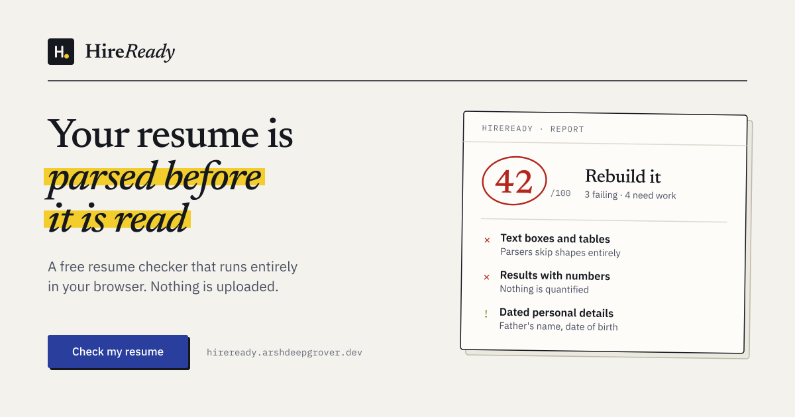

<div align="center">


# HireReady

**See your resume the way a screener does - before a person ever reads it.**

A free resume checker that reads your PDF or Word file the way applicant tracking software does,<br />
runs 36 checks across six areas, and names the few fixes worth making. Nothing is uploaded.

[**Try it live →**](https://hireready.arshdeepgrover.dev) &nbsp;·&nbsp;
[How it works](#how-it-works) &nbsp;·&nbsp;
[What it checks](#what-it-checks) &nbsp;·&nbsp;
[Privacy](#privacy) &nbsp;·&nbsp;
[Run it locally](#run-it-locally)


<br />

<a href="https://hireready.arshdeepgrover.dev">
  
</a>

</div>

---

## Why this exists

Most resumes are never read first by a person. They are **converted to plain text, searched by keyword, then skimmed for a few seconds**, and each step quietly drops good candidates:

1. **It gets converted.** Two-column layouts are read straight across and turn into nonsense. Text boxes, headers and images are often dropped. A resume exported as an image reads as blank.
2. **It gets searched.** Recruiters filter the text by language, framework, degree and city. Skills you never named are invisible.
3. **It gets skimmed.** Someone gives the top third a few seconds. An objective that says you are "hardworking and passionate", or a block with your date of birth, uses up that time.

HireReady recreates the parts of that process that are not secret and tells you, in priority order, what to fix. It was built for students and first-time job seekers, especially those taught the "personal details + declaration" college template.

## Before and after

Both versions are bundled in the app. It is the same person with the same history, only written down properly.

| | Before - the college template | After - rewritten around evidence |
|---|---|---|
| **Score** | **49 / 100** · *Rebuild it* | **100 / 100** · *Ready to send* |
| **Bullets** | "Responsible for working on Angular and Ruby on Rails projects" | "Built reusable Angular components in TypeScript and SCSS, improving frontend load times by 20%" |
| **Evidence** | No numbers, no dates, no links | Every claim has a number an interviewer can ask about |
| **Extras** | Career objective, MS Office, nationality, declaration | Named stack, full URLs, nothing that wastes the first skim |

## Features

- **Reads real files** - PDF (via pdf.js) and Word `.docx` (via JSZip), plus `.txt`, `.md` and `.rtf`, or plain pasted text
- **Catches layout traps** - multi-column reading order, image-only pages, broken font encodings, text boxes, tables, and contact details trapped in headers
- **36 weighted checks** - each result says what it found, why it matters and exactly how to fix it, with excerpts quoted from your resume
- **"Fix these first"** - the five highest-impact changes, ranked by how many points they are worth
- **Job-posting match** - paste a job description to see which of its key terms and named tools your resume already covers. This is kept **out of the score** on purpose, so it cannot push you towards keyword stuffing.
- **Export** - copy the report as text, download it as Markdown, or save it as a PDF
- **Light and dark themes**, keyboard shortcuts (`Ctrl/⌘ + Enter`), drag and drop anywhere, and paste a file straight from the clipboard
- **Fast** - results in about a second; pdf.js loads only when you actually open a PDF

## What it checks

| Area | What it looks for |
|---|---|
| **Machine readable** | Selectable text, reading order across columns, font encoding, text boxes and tables, images, header and footer content, file format |
| **Contact and links** | Email and phone near the top, a professional address, LinkedIn / GitHub / portfolio links, full URLs, city |
| **Structure** | Standard headings, enough detail under each entry, dates on entries, section order, your name on the first line |
| **Writing** | Bullets that open with an action verb, results with numbers, no "I" or "my", no filler phrases, a summary that earns its space, bullet length, varied phrasing |
| **Skills** | Named, searchable technologies, breadth across the stack, no padding ("MS Office", "punctuality"), skills that show up in your actual work |
| **Presentation** | No dated personal details, length, page count, file name, common misspellings, SHOUTING IN CAPS |

The score runs from 0 to 100 and falls into one of four bands: **Rebuild it**, **Needs work**, **Nearly there** and **Ready to send**.

## How it works

```
File (PDF / DOCX / text)
        │
        ▼
  Parser  ─────────►  ParsedResume   text + lines + layout signals
        │              (columns, text boxes, image-only pages, links)
        ▼
  36 checks ───────►  CheckResult[]  pass / warn / fail, points, fix, evidence
        │
        ▼
  Scorer  ─────────►  Report         weighted score, band, category bars,
                                     top-5 actions
```

The engine in `src/core` is **pure TypeScript**. It never touches the DOM or the network, so the same code runs in the browser and in the Node smoke test.

## Privacy

**Your resume never leaves your browser.** This is a technical fact, not a marketing line:

- There is no server that could receive your file. The PDF and Word readers are JavaScript that runs on your machine.
- There are no accounts, no analytics and no third-party requests. Even the fonts are served from this domain.
- A strict `Content-Security-Policy` blocks connections to any other site.
- **You can check this yourself:** open your browser's network tab and run a resume through it, or turn off your Wi-Fi first. The app keeps working.

Your text is kept only in this tab's `sessionStorage`, so a reload does not lose your work. It is cleared when you close the tab. Full details are in the [privacy note](https://hireready.arshdeepgrover.dev/privacy).

## Tech stack

| | |
|---|---|
| **Language** | TypeScript (strict mode, `noUncheckedIndexedAccess`, `exactOptionalPropertyTypes`) |
| **Build** | Vite 8, a multi-page app with no framework |
| **Parsing** | [pdf.js](https://mozilla.github.io/pdf.js/) for PDF, [JSZip](https://stuk.github.io/jszip/) for DOCX |
| **Styling** | Hand-written CSS with design tokens, no CSS framework |
| **Type** | Newsreader, IBM Plex Sans and IBM Plex Mono, all self-hosted |
| **Hosting** | Vercel, fully static, with strict security headers |

## Run it locally

Requires **Node.js 20.19 or newer**.

```bash
git clone https://github.com/ArshdeepGrover/HireReady.git
cd HireReady
npm install
npm run dev
```

Then open <http://localhost:5173>.

| Command | What it does |
|---|---|
| `npm run dev` | Starts the dev server |
| `npm run build` | Type-checks and builds to `dist/` |
| `npm run preview` | Serves the production build locally |
| `npm test` | Type-check plus the engine smoke test |
| `npm run smoke` | Runs the analyser over the bundled samples and prints the scores |
| `npm run verify` | End-to-end check in headless Chrome |
| `npm run assets` | Regenerates the social image and app icons |
| `npm run fonts` | Re-downloads the self-hosted webfonts |

## Project structure

```
├── index.html            Landing page
├── resume-score.html     The checker
├── privacy.html          Privacy note
├── src/
│   ├── core/             Pure analysis engine, with no DOM and no network
│   │   ├── parsers/      PDF, DOCX and plain-text readers
│   │   ├── checks/       The 36 checks, grouped by category
│   │   ├── dictionaries  Action verbs, filler phrases, skills, section patterns
│   │   ├── jobmatch.ts   Job-description keyword comparison
│   │   └── score.ts      Weighting, bands and prioritised actions
│   ├── ui/               Controller, report rendering, export
│   ├── lib/              Small DOM, theme and draft helpers
│   └── styles/           Design tokens and component CSS
├── public/               Fonts, icons, social image, sitemap
└── scripts/              Asset generation, font vendoring, smoke and browser tests
```

## Adding a check

1. Add a function to the right file in `src/core/checks/`. It receives the parsed resume and returns `CheckResult[]`.
2. Give it a `weight`. The weight is the number of points available, and it doubles as the check's priority.
3. Every non-passing result needs a `fix`: one concrete instruction, not a general tip.
4. Run `npm test` to confirm the bundled "before" sample still fails and the "after" sample still passes.

## Contributing

Issues and pull requests are welcome, especially:

- resumes that the parser reads badly (please remove personal details first)
- false positives, where a check flags something that is actually fine
- new action verbs, filler phrases or technologies for the dictionaries

Please open an issue before starting a large change.

## Author

Built by **Arshdeep Singh Grover** - full-stack developer, speaker and mentor.

[arshdeepgrover.dev](https://arshdeepgrover.dev) · [LinkedIn](https://www.linkedin.com/in/arshdeepgrover) · [GitHub](https://github.com/ArshdeepGrover)

If HireReady helped you, a ⭐ on the repo helps other students find it.

## License

[MIT](LICENSE) © 2026 Arshdeep Singh Grover
